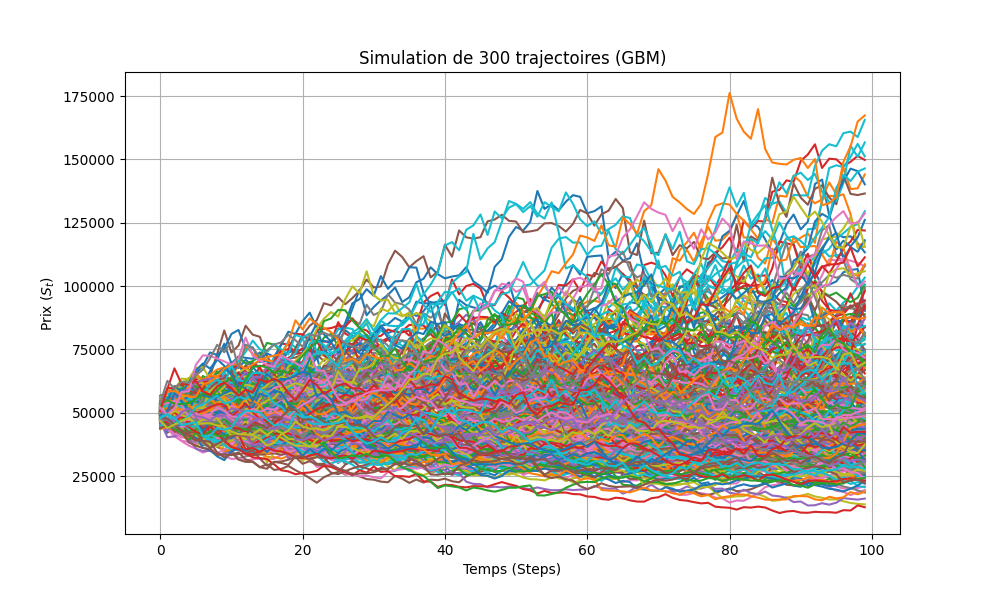
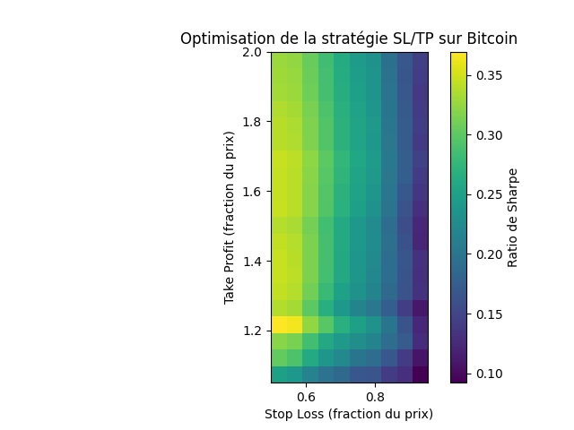

# Finance Simulator

A Python-based financial simulation and optimization toolkit for backtesting stop-loss/take-profit strategies using Geometric Brownian Motion (GBM).

## Features

- **GBM Simulator**: Monte Carlo simulation of asset price movements
- **Strategy Optimizer**: Grid search optimization for stop-loss and take-profit levels
- **Performance Metrics**: Expected wealth, Sharpe ratio, Value-at-Risk (VaR), and loss probability
- **Visualization**: Price trajectories, return distributions, and strategy heatmaps

## Project Structure

```
finance_sim/
├── simulator.py      # GBMSimulator class for price simulations
├── optimizer.py      # LSTPOptimizer class for SL/TP optimization
├── main.py          # Example usage
└── readme.md        # This file
```

## Quick Start

```python
from simulator import GBMSimulator
from optimizer import LSTPOptimizer

# run GBM simulation
sim = GBMSimulator(s0=50000, mu=0.002, sigma=0.05, n_steps=100, n_sims=1000)
sim.run_simulation()
sim.plot_simulation()

# search for the best stop-loss / take-profit pair
optimizer = LSTPOptimizer(sim, sl_min=0.5, sl_max=0.95, tp_min=1.05, tp_max=2.0)
best_sl, best_tp = optimizer.optimize()
print(f"best SL={best_sl}, best TP={best_tp}, win rate={optimizer.best_win_rate:.2%}")
optimizer.plot_sharpe_ratio()
optimizer.plot_optimal_equity_curve()
```
## Example Outputs

Below are sample visualizations produced by the simulator and optimizer.

### Monte Carlo Simulation (Example 2)



### Sharpe Ratio Heatmap




## API Overview

### GBMSimulator
- `run_simulation()`: Generate price paths
- `apply_sl_tp()`: Apply exit rules
- Properties: `expected_wealth`, `std_dev`, `loss_probability`, `var (value at risk)`

### LSTPOptimizer
- `optimize()`: Grid search over SL/TP parameters
- `plot_sharpe_ratio()`: Visualize results